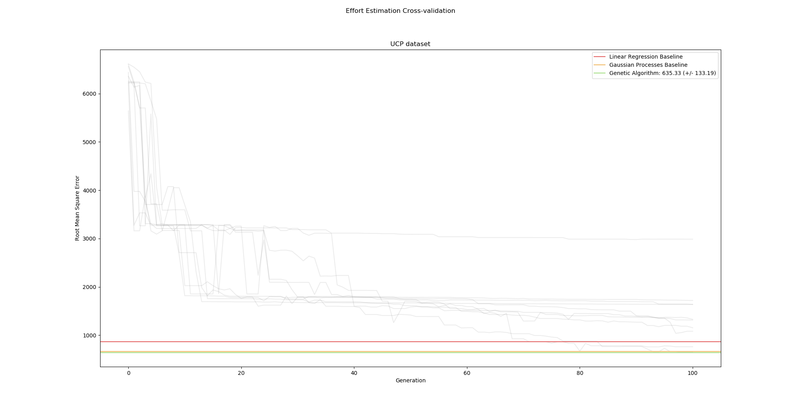

# Effort Estimation with Genetic-Programming
## [Report](ATSE-Assignment4-VladyVeselinov)



## To Run:
### 1. Install [pipenv](https://github.com/kennethreitz/pipenv)
```bash
$ pip install pipenv
```

### 2. Cd to project directory and:
```bash
$ pipenv install
```

```bash
$ pipenv shell
```

```bash
$ python src/runUCP.py
```


#### If you prefer not to use pipenv:
You'll need to install [DEAP](https://github.com/DEAP/deap) globally:
```bash
$ pip install deap
```
or using [Conda](https://github.com/conda/conda)
```bash
$ conda install -c conda-forge deap
```

```bash
$ python src/runUCP.py
```
✨🍰✨